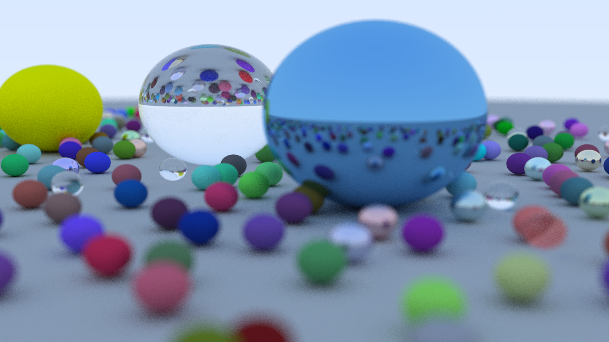

# 简单光线追踪程序


计算机图形学课程大作业的项目，一个简单的光线追踪程序。

目前仅支持不同材料球体的绘制，包括漫反射材料、金属材料和透明介质材料。相机的视角可变，支持景深效果。

最终的渲染效果图：


## 目录
- [使用](#使用)
  - [直接运行](#直接运行)
  - [修改渲染图大小](#修改渲染图大小)
  - [修改相机参数](#修改相机参数)
  - [修改场景](#修改场景)
  - [添加新物体](#添加新物体)
  - [添加新材料](#添加新材料)
- [License](#License)
## 使用
### 直接运行
项目使用 CodeBlocks 16.01 构建，使用 CodeBlocks 打开 RayTracing.cbp 即可（需开启 C++11 支持，否则需要自己实现 randfloat() 函数返回[0, 1)随机数）。在 Intel Core i7-7500U CPU 2.70GHz 上单线程大约需要1小时12分钟才能渲染完毕，暂时没有加入多线程渲染。输出文件格式为 *.ppm，可以使用 Photoshop 打开。
### 修改渲染图大小
在 main.cpp 中修改以下参数：
```c++
...
int main()
{
	int nx = 1280;  // 长
    int ny = 720;   // 宽
    int ns = 100;   // 采样数，越大图像质量越好，但需要更多的时间渲染
    ...
```
### 修改相机参数
在 main.cpp 中修改以下参数：
```c++
...
int main()
{
    ...
    vec3 lookfrom(8, 2, 10);    // 视线起始点
    vec3 lookat(0, 0, 0);       // 视线终点
    float vfov = 30;            // 垂直视野角度
    float dist_to_focus = 10.0; // 焦距
    float aperture = 0.2;       // 光圈
    ...
```
本程序采用的世界坐标系如图：


修改参数时请确保相机参数与场景中的物体参数保持一致性，否则可能会出现最终的渲染图中没有物体存在或视角不符合预期。
### 修改场景
场景默认是随机生成的，可以修改 main.cpp 中`random_scene()`函数得到不同的场景，该函数需要返回一个包含所有物体的`hitable_list`对象指针。

目前只有球这一种物体，添加球需要指定球心、球半径和表面材料：
```c++
sphere(vec3 center_, float radius_, material *m)
```
目前支持的材料只有漫反射材料、金属材料和透明介质材料。

###### 漫反射材料
```c++
lambertian(const vec3& a)
```
需要指定材料的颜色 RGB 向量 a ，数值范围[0, 1].
###### 金属材料
```c++
metal(const vec3& a, float f)
```
需要指定材料的颜色 RGB 向量 a ，数值范围[0, 1]，以及表面粗糙程度 f ，数值范围[0, 1].
###### 透明介质材料
```c++
dielectric(float ri)
```
需要指定折射率 ri.
### 添加新物体
增加自己的物体需要继承`hitable`类，并实现`hit()`方法，`hit()`方法如下：
```c++
bool hit(const ray &r, float t_min, float t_max, hit_record &rec)
```
光线 r 使用直线的向量形式表示：r = origin + t*direction，其中 origin 为起始点， direction 为方向向量。该方法判断光线 r 在 t_min <= t <= t_max 时是否与物体会有交点，如果有交点，则将交点信息写入 rec 中。可以参考 sphere.h 中的实现。
### 添加新材料
增加其他材料需要继承`material`类，并实现`scatter()`方法，`scatter()`方法如下：
```c++
bool scatter(const ray& r_in, const hit_record& rec, vec3& attenuation, ray& scattered)
```
该方法接受一个射入光线 r_in 和交点记录 rec ，返回反射光线 RGB 分量上的衰减程度向量 attenuation （该向量即材料表面的颜色），以及反射光线 scattered. 可以参考 material.h 中的实现。
## License
[GPL](https://github.com/Bil369/simpleRayTracing/blob/master/LICENSE) &copy; [Bil369](https://github.com/Bil369)